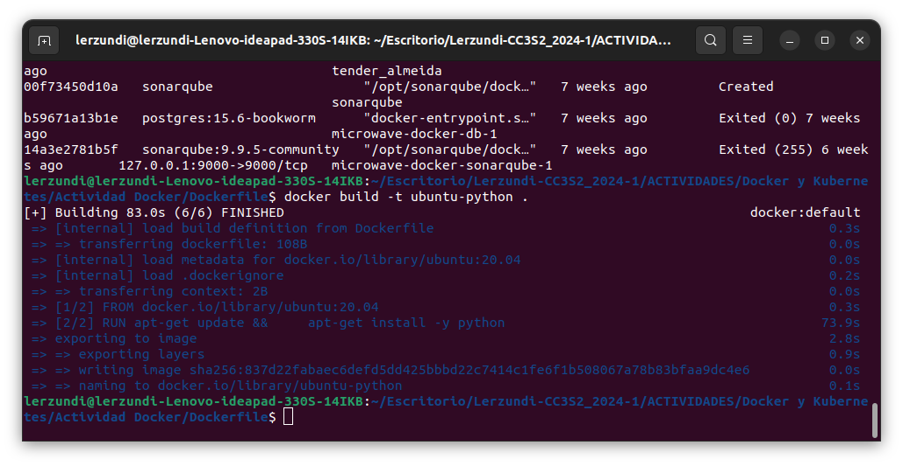
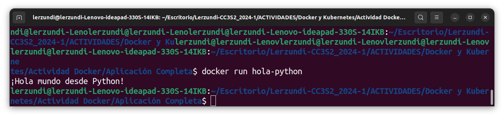

# Actividad: Introducción a Docker
[Link de la Actividad](https://univirtual.uni.pe/pluginfile.php/635769/mod_resource/content/1/Docker.pdf)

### Ejecutando Docker hello-world
  

### Aplicaciones docker  
Instalaremos MongoDB como ejemplo, podemos buscarlo en [Docker Hub](https://hub.docker.com/search?q=mongo), pero esta vez lo haremos por la terminal.

Usamos el comando `docker search <nombre_app>` .

```shell
docker search mongo
```


Elegimos el primero resultado pues no contiene prefijos y corremos `docker run mongo`.


### Creación de imágenes de Docker

Tomaremos de ejemplo Ubuntu 22.04 y ejecutamos el comando 

```shell
docker run -i -t ubuntu:22.04 /bin/bash
```

Lo cual descarga la imagen de Ubuntu 22.04 desde Docker Hub y lo ejecuta como contenedor.

En la terminal de Ubuntu que se ha abierto instalamos el kit de herramientas de Git.

```shell
root@d55c9c0a616b:/# apt-get update
root@d55c9c0a616b:/# apt-get install -y git
```

Comprobamos que se instalado correctamente.

```shell
root@d55c9c0a616b:/# which git
/usr/bin/git
```

Salimos del contenedor y verificamos que ha cambiado el contenedor comparando su ID base y su ID luego de instalar las herramientas de Git.

```
root@d55c9c0a616b:/# exit
$ docker diff d55c9c0a616b
```


Vemos que hay una lista de archivos que han sido modificados/agregados

Hacemos commit del contenedor a la imagen.

```shell
$ docker commit d55c9c0a616b ubuntu-git
```

Listamos las imágenes y verificamos que nuestro commit ha sido satisfactorio.

```shell
$ docker images
```


Si usamos `docker commit <id>` sin `ubuntu-git` el nombre repositorio y el tag estarán vacíos.

### Dockerfile

Creamos un directorio nuevo y un archivo Dockerfile en el que ponemos lo siguiente:

```dockerfile
FROM ubuntu:20.04
RUN apt-get update && \
    apt-get install -y python
```

Luego, creamos la imagen de `ubuntu-python`.

  

### Aplicación Docker completa

Creamos un archivo `hola.py` que contenga **"¡Hola mundo desde Python!"** y creamos un Dockerfile con el siguiente contenido.

```dockerfile
FROM ubuntu:20.04
RUN apt-get update && \
    apt-get install -y python
COPY hola.py .
ENTRYPOINT [ "python", "hola.py" ]
```

Luego, ejecutamos el Dockerfile.

  

Por último ejecutamos la imagen que hemos creado con `docker run hola-python`



