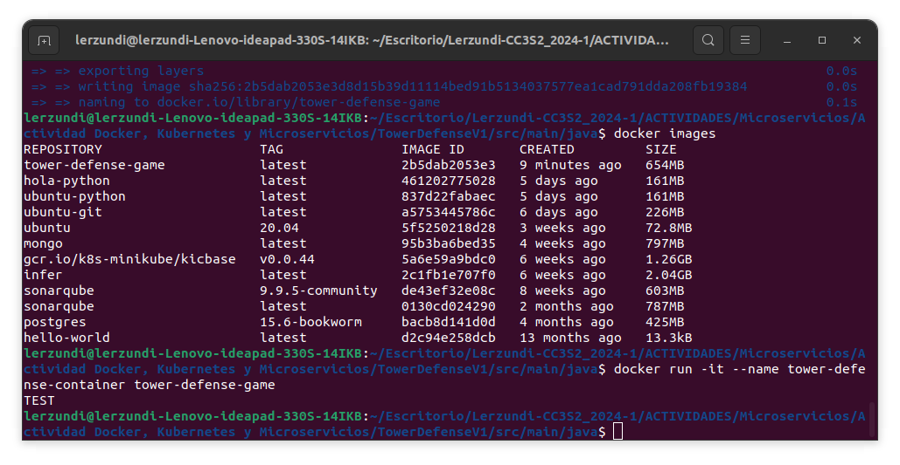
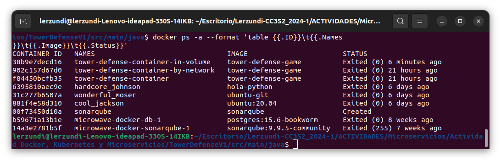
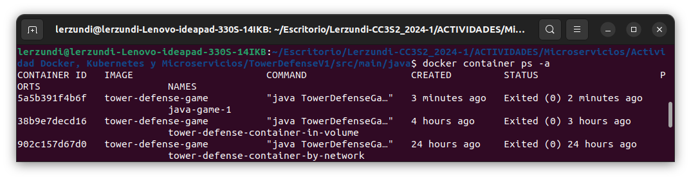
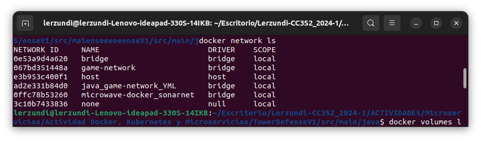
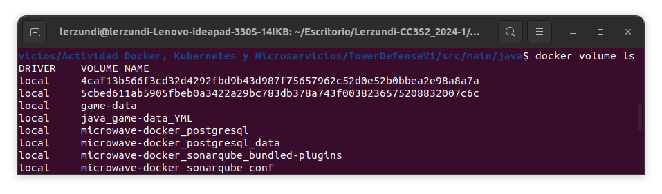

# Desarrollo y despliegue de una aplicación con Docker, Docker Compose, Kubernetes y microservicios

### Configurar y ejecutar contenedores Docker

Creamos la siguiente estructura con el código provisto en la actividad.

```
└── 📁java
    └── Dockerfile
    └── Enemy.java
    └── Map.java
    └── Player.java
    └── Tower.java
    └── TowerDefenseGame.java
    └── Wave.java
```

Nuestro archivo de Dockerfile contendrá  

```dockerfile
FROM openjdk:11
WORKDIR .
COPY . .
RUN javac TowerDefenseGame.java
CMD ["java","TowerDefenseGame"]
```

Ahora creamos la imagen a partir del `Dockerfile`

```shell
docker build -t tower-defense-game .
```

Y ejecutamos la imagen

```shell
docker run -it --name tower-defense-container tower-defense-game
```

Comprobamos que se ejecutó correctamente insertando un mensaje en el método main.

```java
public static void main(String[] args) {
        System.out.println("TEST");
    }
```



### Configurar redes y volúmenes en Docker

Creamos una red personalizada

```shell
docker network create game-network
```
Luego, ejecutamos el contenedor en la red

```shell
docker run -it --name tower-defense-container-by-network --network game-network tower-defense-game
```

Creamos y montamos un volumen

```shell
docker volume create game-data
```

```shell
docker run -it --name tower-defense-container-in-volume --network game-network -v game-data:/data tower-defense-game
```


Con lo anterior creamos un contenedor `tower-defense-container-in-volume`  y lo conectamos a la red `game-network`,
luego montamos el volumen `game-data` en el contenedor en `/data` usando la imagen `tower-defense-game`.

```shell
pwd
/home/lerzundi/Escritorio/Lerzundi-CC3S2_2024-1/ACTIVIDADES/Microservicios/Actividad Docker, Kubernetes y Microservicios/TowerDefenseV1/src/main/java
```



### Interacción con contenedores usando docker exec

```shell
docker exec -it tower-defense-container /bin/bash
```

```shell
ls /app
```
**TODO: El contenedor no se mantiene activo para ingresar los comandos**

### Implementación con Docker Compose

Creamos nuestro archivo YAML.

```yaml
version: '3'
services:
  game: # First server/container
    image: tower-defense-game
    networks: # Network to join
      - game-network_YML
    volumes:
      - game-data_YML:/data
networks:
  game-network_YML: # Network definition
    driver: bridge
volumes:
  game-data_YML: # Volume definition
    driver: local
```

Iniciamos los servicios

```shell
docker compose up -d
```

Podemos ver el nombre del contenedor, volumen y red con el sufijo _YML para diferenciarlos de los creados anteriormente.  






### Despliegue en Kubernetes


