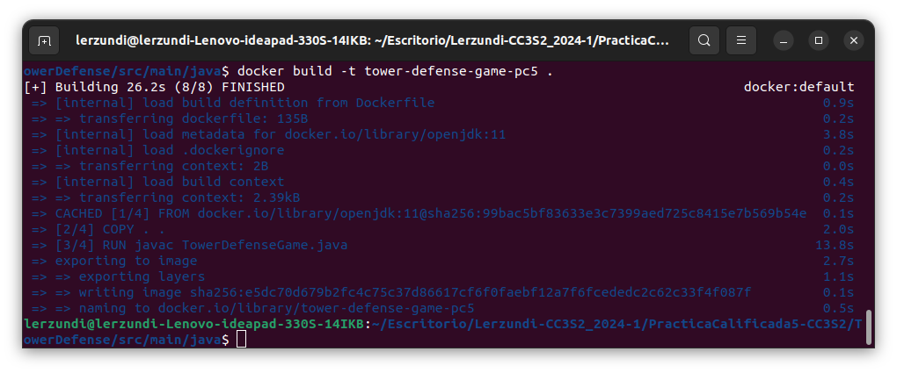
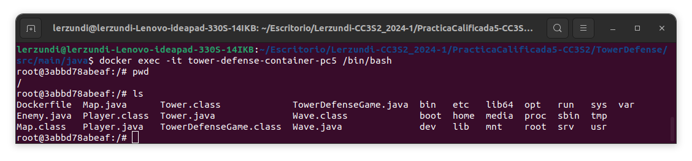
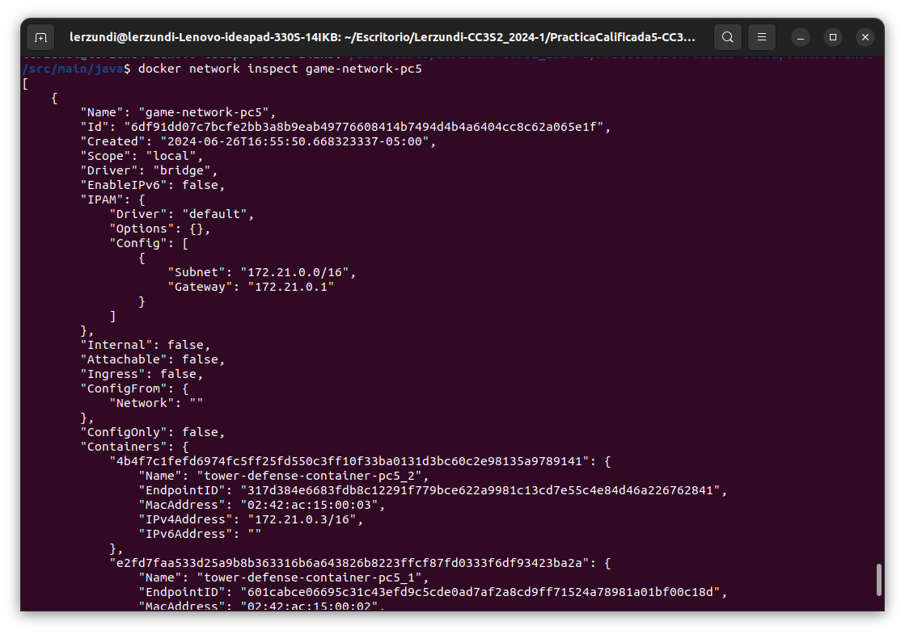
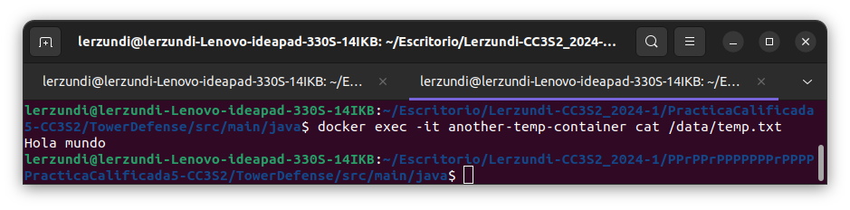

# Práctica Calificada 5

### Ejercicio 1: Configuración y uso de docker (3 puntos)
**Teoría:**

- Describe los principios fundamentales de los contenedores Docker y su arquitectura interna. Explica cómo Docker maneja la seguridad y el aislamiento de contenedores.
>     - Respuesta

- Compara y contrasta Docker con soluciones de virtualización tradicionales, como VMware y VirtualBox. Discute las ventajas y desventajas de cada enfoque.
>     - Respuesta

**Práctico:**

- Escribe un Dockerfile para la aplicación Tower Defense que incluya la instalación de todas las dependencias necesarias. Asegúrate de optimizar el Dockerfile para reducir el tamaño de la imagen final.

```dockerfile
FROM openjdk:11
WORKDIR .
COPY . .
RUN javac TowerDefenseGame.java
CMD ["java","TowerDefenseGame"]
```

- Construye y ejecuta el contenedor Docker utilizando el Dockerfile creado. Utiliza docker exec para acceder al contenedor y verificar que la aplicación funcione correctamente.

```shell
docker build -t tower-defense-game-pc5 .
```


```shell
docker run -it --name tower-defense-container-pc5 tower-defense-game-pc5
```

```shell
docker exec -it tower-defense-container /bin/bash
```



- Configura una red personalizada para la aplicación Tower Defense. Implementa múltiples contenedores que interactúen entre sí a través de esta red personalizada.

```shell
docker network create game-network-pc5
```

```shell
docker run -it --name tower-defense-container-pc5_1 --network=game-network-pc5 tower-defense-game-pc5
```
```shell
docker run -it --name tower-defense-container-pc5_2 --network=game-network-pc5 tower-defense-game-pc5
```

```shell
docker network inspect game-network-pc5
```



### Ejercicio 2: Redes y volúmenes en Docker (3 puntos)
**Teoría:**

- Explica en detalle cómo Docker maneja las redes y los volúmenes. Discute los diferentes tipos de redes (bridge, host, overlay) y cuándo es apropiado usar cada una.
>     - Respuesta
 
- Describe los mecanismos de persistencia de datos en Docker, incluyendo volúmenes y bind mounts. Explica las diferencias entre ellos y las mejores prácticas para su uso.
>     - Respuesta  

**Práctico:**

- Crea una red personalizada para el proyecto Tower Defense y configura los contenedores para que utilicen esta red.  
[^](#ejercicio-1-configuración-y-uso-de-docker-3-puntos)
- Implementa un volumen Docker para almacenar los datos del juego de forma persistente. Asegúrate de que el volumen se monte correctamente y que los datos persistan después de reiniciar el contenedor.

```shell
docker volume create game-data-pc5
```

Creamos un contenedor temporal y montamos un volumen de `/data/`.

```shell
docker run -it --name temp-container --network=game-network-pc5 -v game-data-pc5:/data tower-defense-game-pc5
```

Luego creamos un archivo de texto dentro del volumen

```shell
docker exec -it temp-container bash
root@907591e91155:/# echo "Hola mundo" > /data/temp.txt
root@907591e91155:/# exit
exit
```
Borramos el contenedor `temp-container` y creamos otro `another-temp-container` y leemos nuestro archivo de texto.

```shell
docker container rm temp-container
```

```shell
docker run -it --name another-temp-container --network=game-network-pc5 -v game-data-pc5:/data tower-defense-game-pc5
```



- Utiliza docker-compose para definir los servicios de la aplicación Tower Defense, incluyendo redes y volúmenes. Escribe un archivo docker-compose.yml que configure estos servicios y despliega la aplicación utilizando Docker Compose.


### Ejercicio 3: Orquestación con Kubernetes (4 puntos)

**Teoría:**
- Describe la arquitectura de Kubernetes y sus componentes principales, incluyendo el API server, etcd, scheduler, y kubelet. Explica cómo estos componentes interactúan para gestionar un clúster de Kubernetes.
>      - Respuesta

- Discute las estrategias de escalabilidad y alta disponibilidad en Kubernetes. Explica cómo Kubernetes maneja la recuperación de fallos y la gestión de réplicas.
>      - Respuesta

**Práctico:**

- Escribe un archivo deployment.yaml para la aplicación Tower Defense. Asegúrate de definir los recursos necesarios (CPU, memoria) y las políticas de escalabilidad.
- Implementa un Service en Kubernetes para exponer la aplicación Tower Defense a través de una IP pública. Utiliza un LoadBalancer para distribuir el tráfico entre múltiples réplicas de la aplicación.
- Despliega la aplicación Tower Defense en un clúster de Kubernetes. Utiliza kubectl para gestionar el despliegue y verificar que la aplicación funcione correctamente en el clúster.

### Ejercicio 4: Pruebas unitarias y de integración con Mockito (4 puntos)

***Teoría:***

- Explica los conceptos de mocks, stubs y fakes. Discute cuándo y cómo se deben utilizar estos patrones en las pruebas unitarias.
>     - Respuesta

- Describe el proceso de creación de pruebas unitarias con Mockito. Explica cómo se pueden simular dependencias y verificar comportamientos en las pruebas.
>     - Respuesta

**Práctico:**
- Escribe pruebas unitarias para la clase TowerDefenseGame utilizando Mockito para simular las dependencias de Map, Player y Wave.
- Implementa pruebas de integración que verifiquen la interacción entre las clases principales (TowerDefenseGame, Map, Player, Wave). Utiliza Mockito para controlar y verificar el comportamiento de las dependencias en estas pruebas.
- Configura un pipeline de integración continua (CI) que ejecute automáticamente las pruebas unitarias e informe sobre los resultados. Utiliza herramientas como Jenkins o GitHub Actions para implementar este pipeline (opcional).

#### Ejercicio 5: Pruebas de mutación (4 puntos)

***Teoría:***

- Define qué son las pruebas de mutación y cómo contribuyen a la mejora de la calidad del software. Explica los tipos de operadores de mutación y su propósito.
>     - Respuesta
- Discute las métricas utilizadas para evaluar la efectividad de las pruebas de mutación, como la tasa de mutación (mutation score) y la cobertura de mutación.
>     - Respuesta

**Práctico:**

- Configura una herramienta de pruebas de mutación, como PIT, en el proyecto Tower Defense. Asegúrate de integrar la herramienta en el pipeline de CI (opcional).
- Implementa pruebas de mutación para la clase Map y analiza los resultados. Asegúrate de identificar y corregir las pruebas unitarias que no detecten mutaciones.
- Realiza un informe detallado sobre la calidad de las pruebas del proyecto Tower Defense, basado en los resultados de las pruebas de mutación. Incluye recomendaciones para mejorar la cobertura y efectividad de las pruebas.

### Ejercicio 6: Diseño por contrato (Design by Contract) (2 puntos)

**Teoría:**

- Explica el concepto de diseño por contrato y cómo se aplica en el desarrollo de software. Discute las diferencias entre precondiciones, postcondiciones e invariantes.
>     - Respuesta
- Describe cómo el diseño por contrato puede mejorar la robustez y mantenibilidad del
código.
>     - Respuesta

**Práctico:**

- Aplica el diseño por contrato a la clase Tower. Define las precondiciones, postcondiciones e invariantes de los métodos principales de la clase.
- Escribe pruebas unitarias que verifiquen el cumplimiento de los contratos definidos para la clase Tower. Utiliza herramientas como Java Assertions para implementar estas verificaciones.
- Realiza una revisión de código para asegurarte de que todas las clases del proyecto Tower Defense siguen los principios del diseño por contrato. Documenta cualquier ajuste o mejora necesaria en el código.